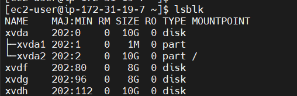
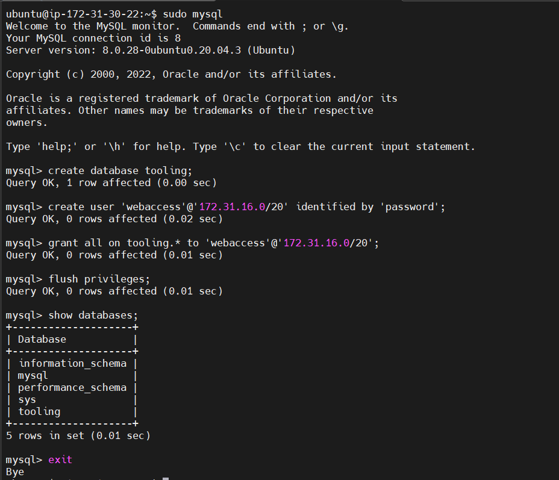

# Project 7

Launched 4 EC2 Instances within the same subnet using Red Hat Linux distribution, 1 for the NFS server & 3 for the Web Servers. 

Launched 1 Ubuntu Linux distro - within the same subnet also - to serve as the Database server.

Attached an 8gb, 8gb & 10gb EBS volumes to the NFS server to be formatted and made into 3 lv's.

updating red hat

`$sudo yum update -y`

listing blocks attached to the nfs server

`$lsblk`

creating partitions on the disks:

`$sudo gdisk /dev/xvdf`

`$sudo gidsk /dev/xvdg`

`$sudo gdisk /dev/xvdh`

listing the attched blocks to confirm the configured partitions

`$lsblk`

installing lvm2 package

`$sudo yum install lvm2 -y`

creating the pv's:

`$sudo pvcreate /dev/xvdf1`

`$sudo pvcreate /dev/xvdg1`

`$sudo pvcreate /dev/xvdh1`

pv creation verification

`$sudo pvs` 

vg's:

adding all pv's to a vg

`$sudo vgcreate webserver-vg /dev/xvdf1 /dev/xvdg1 /dev/xvdh1`

vg creation verification

`$sudo vgs`

lv's:

creating 3 lv's - lv-apps, lv-logs & lv-opt

`$sudo lvcreate -n lv-apps -L 8G webserver-vg`

`$sudo lvcreate -n lv-logs -L 8G webserver-vg`

`$sudo lvcreate -n lv-opt -L 10G webserver-vg`

lv creation verification

`$sudo lvs`

verifying entire setup

`$sudo vgdisplay -v`

formatting the disks as xfs 

`$sudo mkfs -t xfs /dev/webserver-vg/lv-apps`

`$sudo mkfs -t xfs /dev/webserver-vg/lv-logs`

`$sudo mkfs -t xfs /dev/webserver-vg/lv-opt`

creating directories to mount the lv's to

`$sudo mkdir /mnt/apps`

`$sudo mkdir /mnt/logs`

`$sudo mkdir /mnt/opt`

mounting the lv's

`$sudo mount /dev/webserver-vg/lv-apps /mnt/apps`

`$sudo mount /dev/webserver-vg/lv-logs /mnt/logs`

`$sudo mount /dev/webserver-vg/lv-opt /mnt/opt`

updating the /etc/fstab file so the mount conf will remain after restarting the server

getting the uuid of the disks

`$sudo blkid`

`$sudo vi /etc/fstab`

updating fstab

testing configuration and reloading the daemon

`$sudo mount -a`

`$sudo systemctl daemon-reload`

verifying the setup

`$df -h`

installing nfs server 

`$sudo yum install nfs-utils -y`

configuring nfs

`$sudo systemctl start nfs-server.service`

`$sudo systemctl enable nfs-server.service`

`$sudo systemctl status nfs-server.service`

setting r,w,x permissions for web servers on nfs

`$sudo chown -R nobody: /mnt/apps`

`$sudo chown -R nobody: /mnt/logs`

`$sudo chown -R nobody: /mnt/opt`

`$sudo chmod -R 777 /mnt/apps`

`$sudo chmod -R 777 /mnt/logs`

`$sudo chmod -R 777 /mnt/opt`

`$sudo systemctl restart nfs-server.service`

configuring access to nfs for clients within the same subnet cidr

`$sudo vi /etc/exports`

`$sudo exports -arv`

checking the ports nfs is using and adding additional inbound rules

`$rpcinfo -p | grep nfs`

opening ports so client can access nfs:

tcp 111, udp 111, tcp 2049, udp 2049

### configuring database server

updating ubuntu

`$sudo apt update -y`

installing mysql-server

`$sudo apt install mysql-server -y`

verifying sql status

`$sudo systemctl status mysql`

populating db server with a database, a user and granting permission to the user

`mysql create database tooling;`

`mysql create user 'webaccess'@'subnet-cidr' identified by 'password';`

`mysql grant all on tooling.* to 'webaccess'@'subnet-cidr';`

`mysql flush privileges;`

`mysql show databases;`

`mysql exit`

